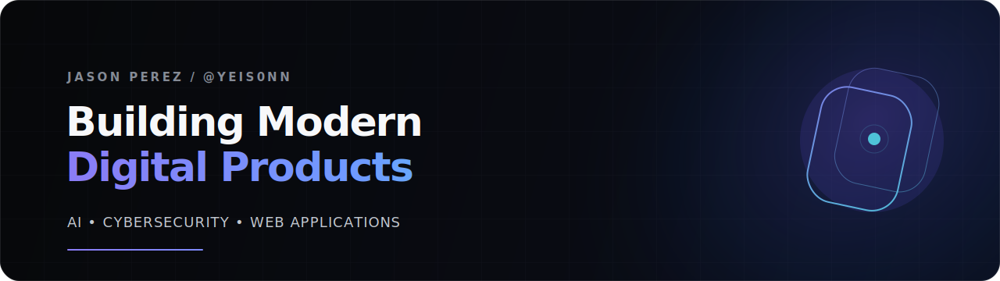

  

 

# Jason Perez

### Digital Product Engineer · Web Developer · Cybersecurity Student

Building modern digital products where AI meets user experience.

I build polished web experiences, AI-ready tools, and practical digital products. I am also studying Cybersecurity at **Universidad Tecnológica de Panamá**, strengthening the security and systems thinking behind the products I create.

---

## Featured Product

  <strong>FLAGSHIP PROJECT</strong>
  <h3>ClipForge AI</h3>
  

    An AI-ready, SaaS-inspired web application for content creators, streamers, and video editors. ClipForge AI generates clip ideas, hooks, titles, descriptions, hashtags, editing recommendations, and viral-potential estimates through a modular architecture prepared for future AI integration.
  

  

    
    
  

> Built as a product, not a classroom exercise: clear positioning, responsive UI, modular logic, and a roadmap toward real AI capabilities.

---

## Tech Stack

**Frontend**

**Currently Learning**

**Cybersecurity & Systems**

**Tools**

---

## Current Focus

**Currently building**

- ClipForge AI and its path toward real AI-assisted generation
- A clear, product-focused personal presence on GitHub
- Future portfolio projects at the intersection of web, AI, and security

**Next milestones**

- Integrate OpenAI capabilities into ClipForge AI
- Build a solid foundation in React
- Develop backend services with Node.js
- Ship more polished, end-to-end portfolio products

---

## 2026 Goals

- [ ] Build and document 10 polished portfolio projects
- [ ] Learn React and Node.js through production-minded projects
- [ ] Learn Docker fundamentals and containerize an application
- [ ] Build real AI-powered applications
- [ ] Deepen my cybersecurity, Linux, and networking fundamentals
- [ ] Earn my first developer role or freelance technology opportunity

---

## Let's Connect

- **GitHub:** [@Yeis0nn](https://github.com/Yeis0nn)
- **Portfolio:** Coming soon
- **LinkedIn:** Coming soon
- **Email:** [jp026583@gmail.com](mailto:jp026583@gmail.com) <!-- Replace with your professional email -->

 

  Code with purpose. Build with intention.

